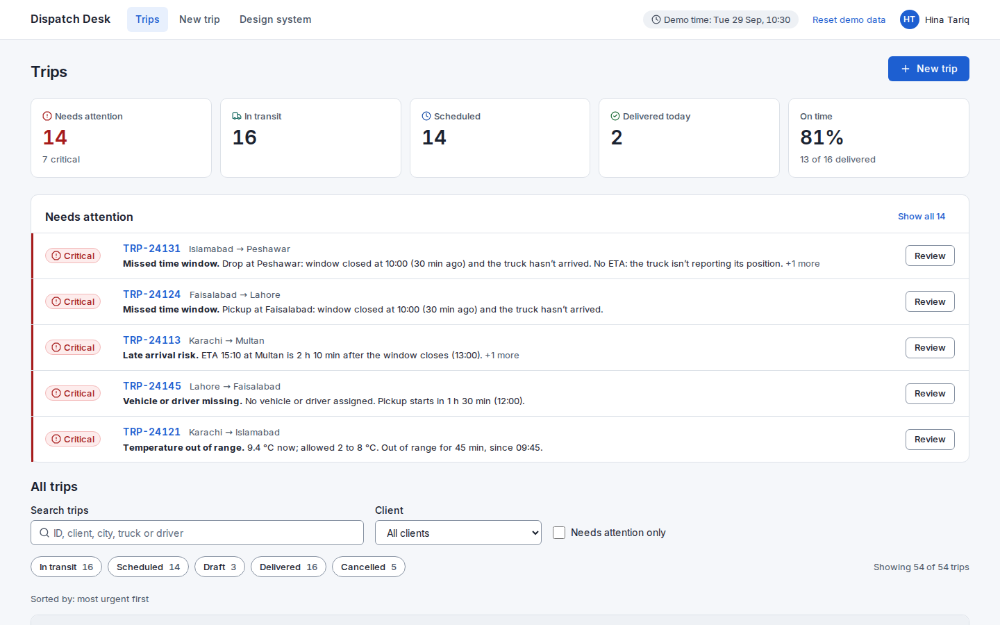
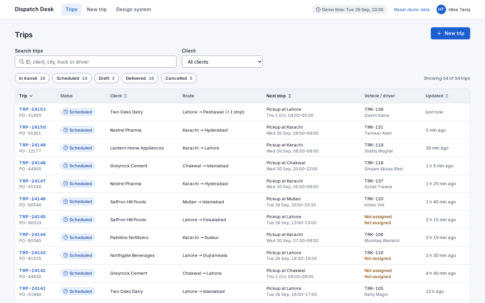

# Dispatch Desk

A prototype dispatch console for a trucking company. It shows which trips need a decision right now, puts the fix next to each problem, and helps create new trips without mistakes.

**Live demo:** https://dispatch-desk-zeta.vercel.app · **Stack:** Next.js 16, React 19, TypeScript, CSS Modules · **Built with:** Claude Code as my AI pair



## The problem

A dispatcher watches dozens of trips at once and is interrupted all day. In a normal trips table they have to scan every row to find the few that need them. Their first question is "what needs me right now?", so this design answers that first: the trips that need a decision are at the top, each problem says in plain words what's wrong, and the fix sits right next to it.

## Try it

The demo clock is frozen at **Tue 29 Sep 2026, 10:30**, so the data always tells the same story. Good places to start:

- **TRP-24131**: the truck stopped reporting its position, and the drop window has closed.
- **TRP-24121**: a pharma load at 9.4 °C, above its 2 to 8 °C limit.
- **TRP-24145**: leaves at 12:00 with no truck or driver. Fix it with Reassign.

Your changes are saved in your browser. **Reset demo data** in the header puts everything back.

## What it does

- **Trips board:** KPIs, a "Needs attention" list of the most urgent trips, and the full table with search, status and client filters, and sorting. The default sort is most urgent first.
- **Trip review:** open problems at the top with the evidence and suggested actions; a route timeline with the truck's last known position; cargo, vehicle, driver and documents; a temperature chart for refrigerated loads; and an activity log.
- **Actions:** reassign the vehicle or driver, reschedule a stop, record what was done, escalate, mark documents received, cancel a trip. Every action is logged, and a handled problem stays visible as "Handled".
- **New trip wizard:** four steps (client and cargo, route and stops, vehicle and driver, review). It only offers trucks that are free and fit the load, warns when a time window is too short for the drive, and saves drafts.
- **Design system page** (`/design-system`): tokens, every component in its states, and the exception rules.

## Key decisions

The full list, with the reasons, is in [docs/DECISIONS.md](docs/DECISIONS.md).

- **Problems first, table second.** A short "Needs attention" list sits above the full table. When nothing needs attention, the page says so plainly instead of showing an empty box.
- **Two severity levels, never colour alone.** Critical and Warning. Critical rows get a red left border, and every badge also has an icon and a word.
- **The fix sits next to the problem.** Problem-specific actions are on each problem card. Trip-wide actions (Reassign, Add note, Cancel trip) are always in the header.
- **Unavailable trucks stay visible, with the reason.** In the wizard and the Reassign dialog, busy or unsuitable trucks are listed separately with why ("On TRP-24121 until 16:00", "Not refrigerated"), because a dispatcher may decide to wait for one.
- **A wizard with a review step.** Each step is checked before moving on, you can jump back to any step you've reached, and the last step shows everything with "Change" links.

## Before and after

| Before: a standard trips table | After: exceptions first |
|---|---|
|  |  |

The first version was the table most apps would have: sorted by trip ID, with every trip looking equally important. The problems were in the data, but you had to scan 54 rows to find them. The second version adds the KPIs, the "Needs attention" list and an Attention column, and sorts by urgency, so the seven critical trips are the first thing you see.

## Design system and accessibility

- Colours, type, spacing, radius and shadows are CSS custom properties, and components only use those tokens.
- Colour pairs are checked against WCAG 2.2 AA: 4.5:1 for text, 3:1 for UI parts and focus.
- Everything works with the keyboard and has a visible focus ring. Dialogs use the native `<dialog>` element and return focus when they close.
- Form errors follow the GOV.UK pattern: an error summary at the top that links to each field, plus a message on the field itself.
- Status and severity always use an icon and text as well as colour. Reduced motion is respected.

## How I used AI

- The written spec, the mock data and the data layer (`src/lib` and `src/data`: the exception rules, the store and the wizard validation) were prepared with AI before I started on the UI.
- I made the product and design decisions myself. They're in [docs/DECISIONS.md](docs/DECISIONS.md).
- Claude Code then built the UI with me, one session per feature: design system, trips board, trip review, wizard. That's why the commits are close together.

## What I'd do next

- Test it with real dispatchers during a shift, and measure how long it takes to spot and handle a problem.
- Live updates (WebSockets or SignalR) instead of a frozen demo clock.
- A map view, and truck suggestions that know where each truck actually is.
- A side panel for faster triage straight from the table.
- Server-side filtering, sorting and paging for thousands of trips.
- Roles and permissions, and dark mode.

## Run it locally

```bash
npm install
npm run dev
```

Then open http://localhost:3000.

All companies, people and vehicles in the data are fictional.
